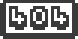

   

# ChipChao's Dead Meme Space
***(yes that is a Radiohead parody)***

Welcome to the ChipChao website! Well, this website is shit, but who the fuck cares!

# Who are ChipChao?

ChipChao is a band comprising of Nikostormkilla and TruncateVirus99. General Fives was a former member of ChipChao and was in the band from June 2021 to December 2021 when he left during The Bono Album's lyrics being written and recorded as before that it was a general idea phase. We are all still friends though.

# What is Dead Meme Space?

Dead Meme Space is two things: it is our website, the one that you are on, and the second is that it is our pseudolabel that we release our music using. It is not an actual label in the fact that it cannot handle distribution on streaming services and would require services such as DistroKid. In a way, it is more of a "vanity label" that has no parent label whatsoever and is only used for releasing music and cannot distribute it. So tdlr; it's our website and our pseudolabel.
